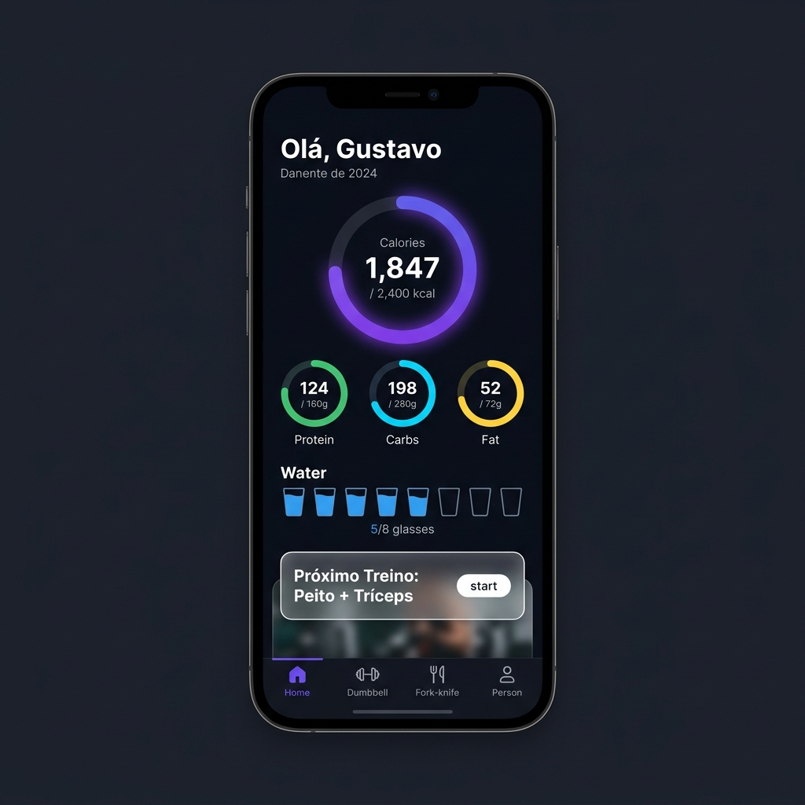
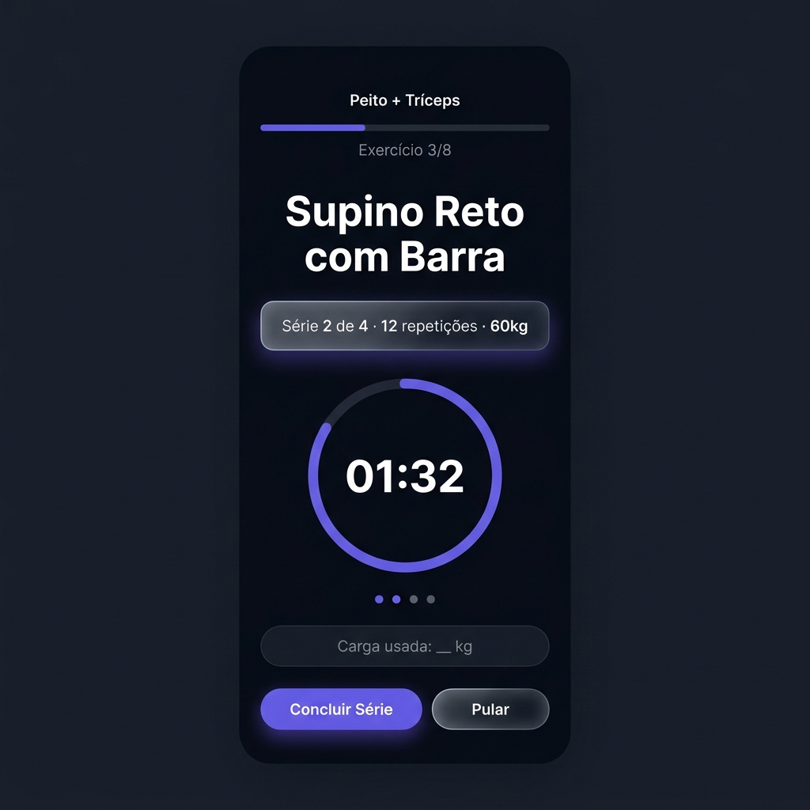
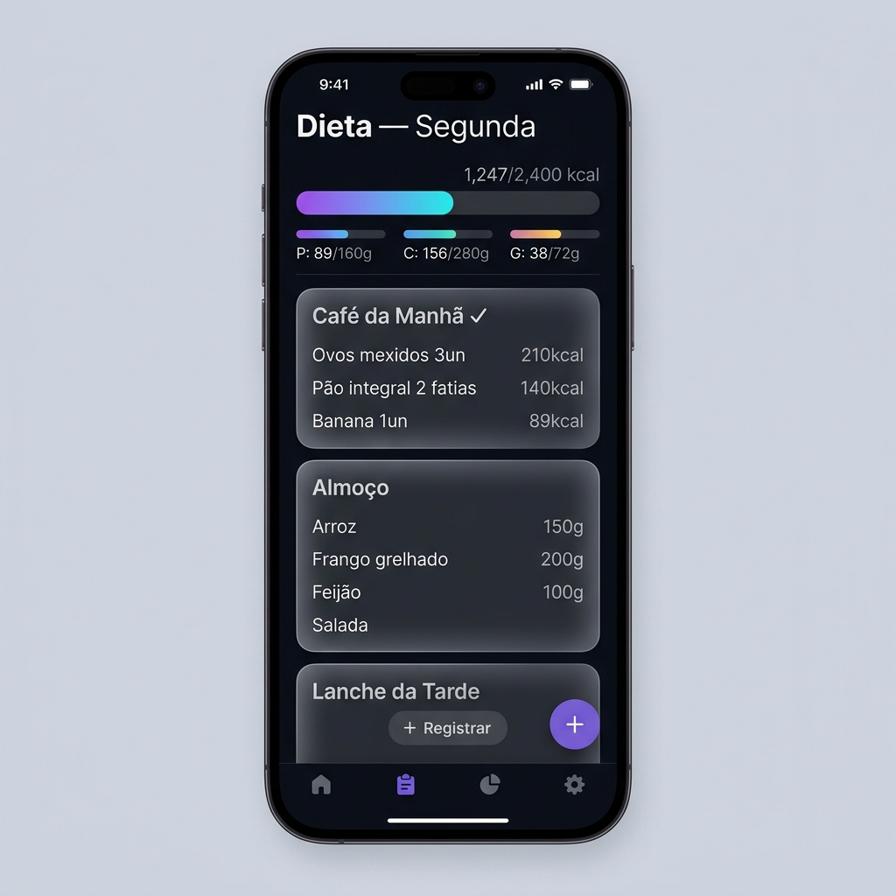
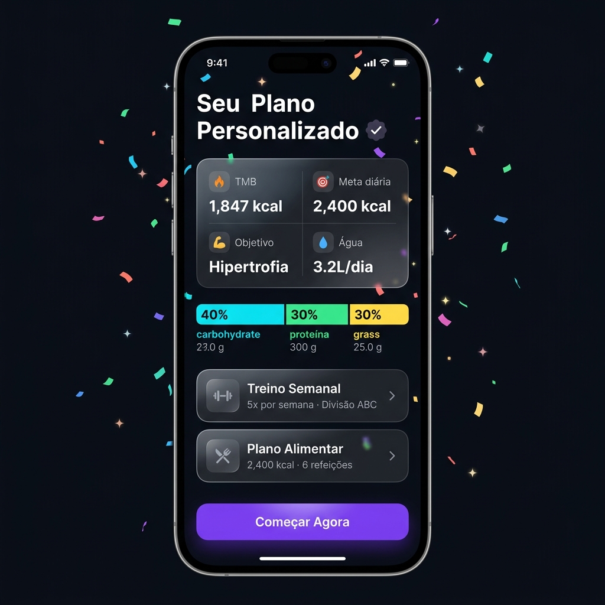

# Planejamento Completo — FitApp

---

## 1. Resumo do FitFolio

**Onboarding/Questionário:** Fluxo step-by-step com telas modulares (idade, peso, altura, nível de atividade, objetivo, restrições alimentares). Barra de progresso no topo e navegação "voltar/avançar". Coleta mínima de dados para gerar o plano inicial — detalhes extras são opcionais.

**Telas principais:** Dashboard centralizado com resumo diário (macros, calorias, streak de treinos). Tela de treino com biblioteca de exercícios categorizados por grupo muscular, com guias visuais. Tela de dieta com registro por refeição (café, almoço, jantar, lanches) e comparação em tempo real com metas de macros.

**Destaques visuais:** Interface limpa com cards arredondados, iconografia SF Symbols, gráficos circulares de progresso (anéis de atividade), e uso de camadas de profundidade com blur. Paleta escura com acentos vibrantes.

---

## 2. Especificação Funcional

### 2.1 Onboarding & Questionário
- Tela de boas-vindas com proposta de valor (1 tela)
- Cadastro/Login (e-mail, Google, Apple Sign-In)
- Questionário em etapas (8-10 telas):
  - Dados pessoais: nome, idade, sexo biológico
  - Corpo: peso atual, altura, % gordura (opcional)
  - Objetivo: hipertrofia / definição / força / emagrecimento / condicionamento
  - Nível de experiência: iniciante / intermediário / avançado
  - Frequência semanal disponível para treinar (2-6x)
  - Restrições alimentares: vegetariano, vegano, intolerância a lactose/glúten, alergias
  - Preferências de treino: musculação, calistenia, misto
  - Equipamentos disponíveis: academia completa / home gym / só peso corporal
- Tela de resultado: exibe TMB, calorias-alvo, macros, meta de água, e o plano gerado

---

## 3. Arquitetura do Sistema

```
┌─────────────────────────────────────────────────────────────────────┐
│                        CLIENTES (Frontend)                         │
│  React Native (Expo Mobile iOS/Android)  |  Next.js (Web PWA)       │
└──────────────────────────────────┬──────────────────────────────────┘
                                   │
                                   ▼
┌─────────────────────────────────────────────────────────────────────┐
│                    CAMADA DE API (Backend)                          │
│   Supabase Auth & Gateway  ──►  Edge Functions (TypeScript/Deno)    │
│                                           │                         │
│                                           ▼                         │
│                                 Claude 3.5 API (Anthropic)          │
└──────────────────────────────────┬──────────────────────────────────┘
                                   │
                                   ▼
┌─────────────────────────────────────────────────────────────────────┐
│                   BANCO DE DADOS (PostgreSQL + RLS)                 │
│   perfis | questionarios | planos_treino | planos_dieta | TACO      │
└─────────────────────────────────────────────────────────────────────┘
```

---

## 4. Stack Técnica Recomendada

| Camada | Tecnologia | Justificativa |
|--------|-----------|---------------|
| Mobile | React Native + Expo | Base única para iOS e Android, ecossistema maduro. |
| Web | Next.js 15 | SSR para SEO, Server Components e mesmo idioma do mobile. |
| Backend | Supabase Edge Functions | Serverless TypeScript/Deno com baixíssima latência. |
| Banco | PostgreSQL | Relacional, ACID, RLS nativo e busca fuzzy. |
| IA | Claude API (Anthropic) | Geração de plano personalizado com output JSON estrito. |
| Alimentos | Tabela TACO (UNICAMP) | Base nacional de composição de alimentos. |

---

## 5. Design System — Liquid Glass

- **Paleta:** Fundo `#0A0E17`, Primária `#6C5CE7` (roxo), Secundária `#00D2FF` (cyan), Sucesso `#00E676`.
- **Efeito:** BlurView (desfoque) + bordas brancas com 12% opacidade + sombras coloridas.

---

## 6. Mockups das Telas Principais

### Dashboard — Tela Inicial


### Treino ao Vivo


### Dieta — Registro de Refeições


### Resultado do Questionário


---

## 7. Visualizador HTML Interativo

Para abrir no navegador com suporte a zoom:
[docs/implementation_plan.html](file:///Users/gustavosoares/Documents/Projetos/FitApp/docs/implementation_plan.html)
